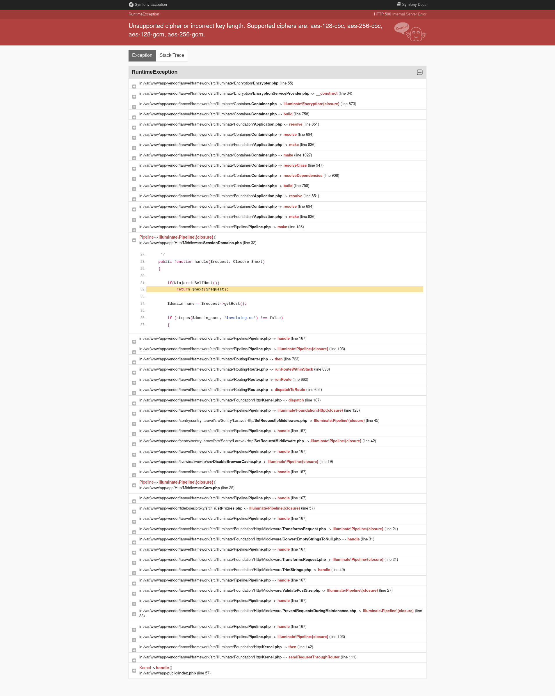

### Trying a docker container alone ...


```bash

# folders for data persistence
mkdir -p /var/invoiceninja/public
mkdir -p /var/invoiceninja/storage

# export GENERATED_INVOICENINJA_APP_KEY=$(openssl rand -hex 16)
export INVOICENINJA_DOCKER_TAG="5.3.66"
docker pull invoiceninja/invoiceninja:${INVOICENINJA_DOCKER_TAG}
export GENERATED_INVOICENINJA_APP_KEY=$(docker run --rm -it invoiceninja/invoiceninja php artisan key:generate --show | tr -d "\n\r")
echo "GENERATED_INVOICENINJA_APP_KEY=[${GENERATED_INVOICENINJA_APP_KEY}]"
docker run -d \
  -v /var/invoiceninja/public:/var/app/public \
  -v /var/invoiceninja/storage:/var/app/storage \
  -e APP_ENV='production' \
  -e APP_DEBUG=0 \
  -e APP_URL='http://ninja.dev' \
  -e APP_KEY=${GENERATED_INVOICENINJA_APP_KEY} \
  -e APP_CIPHER='AES-256-CBC' \
  -e DB_TYPE='mysql' \
  -e DB_STRICT='false' \
  -e DB_HOST='localhost' \
  -e DB_DATABASE='ninja' \
  -e DB_USERNAME='ninja' \
  -e DB_PASSWORD='ninja' \
  -p '80:80' \
  invoiceninja/invoiceninja
# docker run -d \
# -v /var/invoiceninja/public:/var/app/public \
# -v /var/invoiceninja/storage:/var/app/storage \
# -e APP_ENV='production' \
# -e APP_DEBUG=0 \
# -e APP_URL='http://ninja.dev' \
# -e APP_KEY='<INSERT THE GENERATED APPLICATION KEY HERE>' \
# -e APP_CIPHER='AES-256-CBC' \ this vlaue I believe, is not to be changed
```


### Ok so here it is for the docker-compose


```bash
# First, prepare the secrets
mkdir -p ./docker/run/.secrets/
cp -fr ./docker/run.template/* ./docker/run/*

export GENERATED_SECRET=$(openssl rand -hex 32)
echo "${GENERATED_SECRET}" > ./docker/run/.secrets/site_cookiesecret.txt

export GENERATED_SECRET=$(openssl rand -hex 32)
echo "${GENERATED_SECRET}" > ./docker/run/.secrets/site_sessionsecret.txt


export DOCKER_COMPOSE_PATH="docker-compose/run/dev/database/docker-compose.mongo.yml"
docker-compose -f ${DOCKER_COMPOSE_PATH} up -d mongo
# ---> ---> ---> ---> ---> ---> ---> ---> ---> ---> ---> ---> ---> ---> --->
# ---> Then go to http://0.0.0.0:8084/  for the MongoDB WebUI

# To restart with fresh empty database :
# docker-compose -f ${DOCKER_COMPOSE_PATH} down --volumes && docker-compose -f ${DOCKER_COMPOSE_PATH} up --force-recreate -d && docker-compose -f ${DOCKER_COMPOSE_PATH} logs -f mongo_webui | more


source ./.env.sh
# folders for data persistence : i w<ill then prefer creating a linux user named 'invoiceninja', and set its permissions ...
# mkdir -p /var/invoiceninja/public
# mkdir -p /var/invoiceninja/storage
mkdir -p ${HOME}/.invoiceninja/public
mkdir -p ${HOME}/.invoiceninja/storage

# export GENERATED_INVOICENINJA_APP_KEY=$(openssl rand -hex 16)
export INVOICENINJA_DOCKER_TAG="5.3.66"
docker pull invoiceninja/invoiceninja:${INVOICENINJA_DOCKER_TAG}
export GENERATED_INVOICENINJA_APP_KEY=$(docker run --rm -it invoiceninja/invoiceninja php artisan key:generate --show | tr -d "\n\r")
echo "GENERATED_INVOICENINJA_APP_KEY=[${GENERATED_INVOICENINJA_APP_KEY}]"

sed -i ""
```


## Corporate Docker Compose

### Open port 80 on Debian

```bash
export LINUX_NET_INTERFACE="enp0s3"
export PORT_TO_OPEN="8080"
export PORT_TO_OPEN="80"

sudo iptables -I INPUT 1 -i ${LINUX_NET_INTERFACE} -p tcp --dport ${PORT_TO_OPEN} -j ACCEPT
sudo mkdir -p /etc/iptables
sudo /sbin/iptables-save | sudo tee /etc/iptables/rules.v4
sudo /sbin/ip6tables-save | sudo tee /etc/iptables/rules.v6

sudo apt-get install -y iptables-persistent
sudo systemctl is-enabled netfilter-persistent.service
sudo systemctl enable netfilter-persistent.service
sudo systemctl status netfilter-persistent.service --no-pager -l

```

### launch the corporate docker compose


### Result

Well it seems that there's an issue with cryptography



It does not matter what cypher I configure, it does not change.

Never mind, if it does not start imediately, (plsu if it is PHP), it's a bye-bye.

To reproduce :

```bash

```

## References


* A `docker-compose` blended by the `invoiceninja` team : https://github.com/invoiceninja/dockerfiles/blob/master/docker-compose.yml
* About Ip tables : https://www.cyberciti.biz/faq/how-to-save-iptables-firewall-rules-permanently-on-linux/
